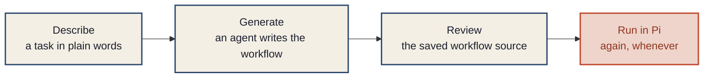
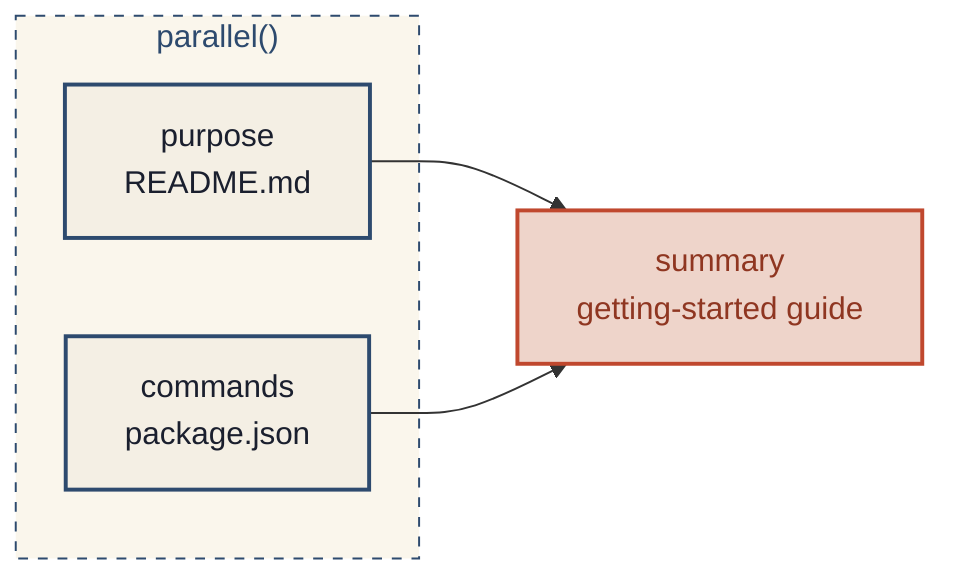

# locus-pi — Dynamic Workflows for Pi

[](https://www.npmjs.com/package/@locus-forge/locus-pi)
[](LICENSE)
[](docs/getting-started.md)
[](docs/getting-started.md)

**Describe a task. Let an agent build a reusable workflow. Run it in Pi.**

locus-pi adds a workflow DSL to [Pi](https://github.com/earendil-works/pi).
Workflows can run agents in parallel, discover more work, and choose the next step
from their results. Save the workflow as a readable JavaScript file and run it again
when you need it. Model roles let you change models without rewriting the workflow.



_Change models through roles; reuse the same workflow source._

[Documentation](docs/index.md) · [DSL reference](docs/workflows/dsl.md) · [Examples](examples/workflows/README.md)

## What it adds

Three core capabilities, shipped as Pi extensions.

| Capability      | What you can do                                                                                                  | Learn more                                             |
| --------------- | ---------------------------------------------------------------------------------------------------------------- | ------------------------------------------------------ |
| **Workflows**   | Save reusable agent processes with parallel steps, branches, and results you can inspect.                        | [DSL reference](docs/workflows/dsl.md)                 |
| **Agents**      | Launch child agents, follow their progress, and open their output through `/ps`.                                 | [Agent guide](extensions/agents/README.md)             |
| **Model roles** | Assign models to role names such as `smol` and `slow` through `/model-roles`, then use those names in workflows. | [Role setup](docs/workflows/models.md#use-model-roles) |

Model assignments are yours to configure; no provider or model assignments ship with the package.

### All six extensions

<table>
  <tr>
    <td width="50%"><a href="extensions/workflows/README.md"><strong>workflows</strong></a><br/>Save and run multi-agent workflows, inspect results, and resume runs.</td>
    <td width="50%"><a href="extensions/agents/README.md"><strong>agents</strong></a><br/>Launch child agents and inspect their progress and results.</td>
  </tr>
  <tr>
    <td><a href="extensions/model/README.md"><strong>model</strong></a><br/>Assign models to reusable roles and adjust thinking effort.</td>
    <td><a href="extensions/ask-user-question/README.md"><strong>ask-user-question</strong></a><br/>Let an agent ask you a question when it needs a decision.</td>
  </tr>
  <tr>
    <td><a href="extensions/ast-structural-edit/README.md"><strong>ast-structural-edit</strong></a><br/>Find code by structure, preview edits, and apply or discard them.</td>
    <td><a href="extensions/status-line/README.md"><strong>status-line</strong></a><br/>See the active model, context use, and working directory at a glance.</td>
  </tr>
</table>

See the [extension guide](docs/extensions.md) for commands and tools. Install the extensions together,
or choose the resources you need with [package filters](docs/getting-started.md#load-only-selected-extensions).

## Install

Requires Node.js `>=22.19.0`, Pi `>=0.83.0`, and a configured model provider.

**From Git:**

```bash
git clone https://github.com/locus-forge/locus-pi.git
cd locus-pi
npm ci --ignore-scripts
pi install .
```

**From npm:**

```bash
pi install npm:@locus-forge/locus-pi
```

The npm release can lag this repository. Use the documentation bundled with your installed version
when checking its available workflows and skills.

**Windows:** use WSL 2 and install Node.js, Pi, and locus-pi inside its Linux environment.
Follow [Windows setup](docs/getting-started.md#windows-use-wsl-2).

Start a fresh Pi session in your project. If locus-pi is already installed, replace
its existing source; keep your other packages. See [installation and updates](docs/getting-started.md).

<details>
<summary>Install only Workflow</summary>

Edit only the locus-pi entry in `~/.pi/agent/settings.json` or `.pi/settings.json`.
For Git, keep its checkout path as `source`; the example below uses npm.

```json
{
  "packages": [
    {
      "source": "npm:@locus-forge/locus-pi",
      "extensions": ["extensions/workflows/index.ts"],
      "skills": []
    }
  ]
}
```

Keep other settings and package entries. `skills: []` disables package skills,
including the workflow creator; omit that field to retain them. The filter controls
what Pi loads. See [package filters](docs/getting-started.md#load-only-selected-extensions).

</details>

## Create a workflow with an agent

Use the [workflow-create skill](skills/locus-pi-workflow-create/SKILL.md) in Pi.
It designs the agent graph, reviews it, builds the source, and checks it:

```text
/skill:locus-pi-workflow-create Create a project-tour workflow: two agents read README.md and package.json in parallel, then a third combines their notes into a getting-started guide. Do not modify project files during the run. Build and check the workflow, but do not run it yet.
```

Review `project-tour.design.md` and `project-tour.workflow.mjs` saved under
`.locus-pi/workflows/project-tour/`, then run:

```text
/workflows run project-tour
/ps
/workflows result last
```

[Create your first workflow](docs/workflows/create.md) explains the skill and includes
complete copyable source. [Run and inspect](docs/workflows/running.md) covers progress,
results, stopping, fresh runs, and replay. For Codex or Claude Code, see [skill installation](skills/README.md).

The skill can author a workflow directly; it does not require running a packaged authoring workflow.
For a staged authoring process, the [task workflows](examples/workflows/task/README.md) provide
`task/draft`, followed by `task/plan` or `task/plan-light` with the complete accepted draft as input.
These ship under `examples/workflows/task/` and appear in the Package tab of `/workflows list`;
`task` itself is a group, not a runnable workflow.

## Explore the DSL and examples

A workflow connects calls such as `agent()`, `parallel()`, and `pipeline()`. Use
`agent(..., { choice: [...] })` for a decision or `agent(..., { handoffs: {...} })`
when an agent discovers the work units. A stage may request `modelRole: "smol"`;
assign the role through `/model-roles` independently of the source.

For example, this workflow gathers two perspectives before combining them:

```js
export const meta = { name: "project-summary", profile: "standard" };

export default async function run({ agent, parallel }) {
  const notes = await parallel([
    () =>
      agent("Read README.md. Explain the project. Do not modify files.", {
        label: "purpose",
        title: "Read project purpose",
      }),
    () =>
      agent("Read package.json. Explain the commands. Do not modify files.", {
        label: "commands",
        title: "Read development commands",
      }),
  ]);
  return agent(`Combine these notes into a getting-started guide. Do not modify files.\n${notes.join("\n\n")}`, {
    label: "summary",
    title: "Write getting-started guide",
  });
}
```



Save it as `.locus-pi/workflows/project-summary/project-summary.workflow.mjs` and
[check the source](docs/workflows/create.md#your-first-workflow) before running it.

- [DSL reference](docs/workflows/dsl.md) — every method, arguments, return values, examples, and availability.
- [Workflow file format](docs/workflows/authoring.md) — metadata, input, and the exported function.
- [Source rules](docs/workflows/source-shape.md) — what the creator may generate and what the checker rejects.
- [Examples](examples/workflows/README.md) — installed workflows under `examples/workflows/` and patterns to adapt.
- [Documentation](docs/index.md) — the entry point for installation, authoring, operation, and deeper topics.

## Repository layout

```text
extensions/              extension implementations and co-located manuals
extensions/_shared/      shared host, operator, runtime, model, and agent-runtime layers
extensions/workflows/    workflow runtime
examples/workflows/      installed reusable workflows and their guides
skills/                  bundled workflow authoring, execution, and external-session skills
scripts/                 repository validation and catalog generation
tests/                   focused and integration tests
docs/                    cross-cutting public guides and workflow reference
```

Project workflows live under `.locus-pi/workflows/`. Runs write local state under `.locus-pi/`,
including outputs, workspaces, and leases. It may contain prompts, model output, or transcripts,
and is ignored by Git. See [architecture and repository boundaries](docs/architecture.md).

## License and security

Licensed under the [MIT License](LICENSE). Run workflows from sources you trust;
see the [workflow trust guide](docs/workflows/trust.md). Report vulnerabilities
through GitHub private vulnerability reporting; use Issues for ordinary defects.
