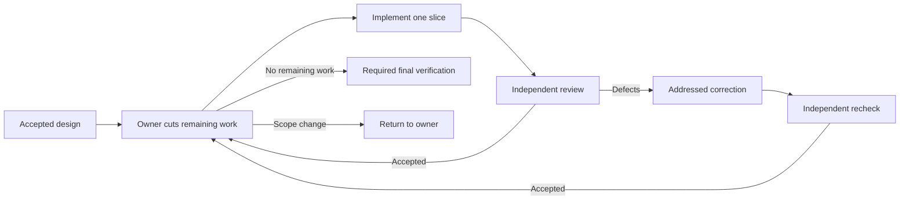

# Create a workflow with an agent

[Documentation](../index.md) · [Workflow reference](index.md) · [DSL methods](dsl.md) · [Run and inspect](running.md)

Use the [workflow-create skill](../../skills/locus-pi-workflow-create/SKILL.md)
to turn a task description into a reusable `.workflow.mjs` file. The skill designs
the agent graph, reviews it, writes the source, and checks it. You can inspect and
edit that source before running it.

## Ask Pi to create it

With the package skills enabled, enter this in Pi:

```text
/skill:locus-pi-workflow-create Create a project-tour workflow: two agents read README.md and package.json in parallel, then a third combines their notes into a getting-started guide. Do not modify project files during the run. Build and check the workflow, but do not run it yet.
```

The resulting files belong under `.locus-pi/workflows/project-tour/`: a
`project-tour.design.md` description and `project-tour.workflow.mjs` source.
Review them, then use `/workflows run project-tour`. See [run and inspect](running.md#run-a-saved-workflow)
for progress, results, and stopping a run. A request to create **and run** continues
through the [run skill](../../skills/locus-pi-workflow-run/SKILL.md).

Pi loads these skills with the full package. A Workflow-only installation with
`skills: []` disables them; enable package skills or write the example below.
For Codex or Claude Code, use the [skill installation guide](../../skills/README.md).

Prefer writing the source yourself? Start with the complete example below, then
use the [DSL reference](dsl.md), [file format](authoring.md), and [source rules](source-shape.md).
The later sections explain larger authoring tasks and adaptive graphs.

## Your first workflow

A workflow is a JavaScript module that coordinates agents. You can write it
by hand or ask Pi to create it with the installed workflow-create skill.
The same saved source can run repeatedly; its stages can branch on agent results
or create parallel work when the task calls for it.

This small example reads a project from two angles in parallel, then asks a
third agent to combine the notes. Use a project containing `README.md` and
`package.json`; adapt the prompts for other projects.

Create `.locus-pi/workflows/project-tour/project-tour.workflow.mjs`:

```js
export const meta = {
  name: "project-tour",
  description: "Read a project from two angles and summarize where to start.",
  profile: "standard",
};

export default async function run({ agent, parallel, phase }) {
  phase("explore");
  const notes = await parallel([
    () =>
      agent("Read README.md and summarize what this project does. Do not modify files.", {
        label: "project-purpose",
        title: "Read project purpose",
      }),
    () =>
      agent("Read package.json and summarize its development commands. Do not modify files.", {
        label: "project-commands",
        title: "Read development commands",
      }),
  ]);
  phase("summarize");
  return await agent(
    `Combine these notes into a short getting-started guide. Do not modify files.\n${notes.join("\n\n")}`,
    {
      label: "getting-started",
      title: "Write getting-started guide",
    },
  );
}
```

`agent()` gives each child its own task. `parallel()` waits for both notes, in
their declared order, before the final agent starts. The workflow passes those
notes to the final agent unchanged. Titles describe the work in the live panel; labels identify calls for replay.
No agent profiles or model assignments are required for this example.

Before running, ask Pi to check the file with `workflow_check_source`:

```json
{
  "path": ".locus-pi/workflows/project-tour/project-tour.workflow.mjs",
  "mode": "orchestration-only"
}
```

Read the source and resolve any diagnostics. Then follow
[run, inspect, and rerun](running.md#run-a-saved-workflow). For optional stage
routing, see [model roles](models.md#use-model-roles).

## Create a workflow

Ask Pi to author a workflow for a task directory:

```text
Create a workflow for .tasks/example. Use adaptive slices and outcome-led briefs.
Build the source, but do not run it. Keep an owner pause between design and implementation.
```

The author writes and reviews a `.design.md` file, builds the declared
`.workflow.mjs` entries, and checks their source. Building creates the program;
it does not execute its agents. Ask for `design only` to stop before source is
built. The task directory is the entry context; agents find `task.md`, the
accepted design and relevant artifacts inside it.

The authoring `.design.md` describes the workflow graph. In the adaptive references,
the design entry later produces the task-change proposal in `artifacts/design.md`.
The owner accepts that proposal before launching the separate implementation entry;
these are two entries and two runs. A successful design run means the proposal is
ready for the owner, not that implementation is authorized.

### Choose a graph and prompt detail

Use an adaptive slice queue when accepted output or findings must determine or
re-cut the remaining work:



The owner revises remaining work after each accepted slice. Later agent calls
therefore depend on discovered work and actual results. A cumulative slice limit
stops repeated re-cutting from running forever. A correction is followed by a
fresh check. Failed or missing required verification cannot become a successful
result by dropping a report.

### Build generated source in complete slices

The Package `task/plan` workflow builds one workspace `workflow.mjs` in complete,
checked graph-node slices. It re-cuts the remaining queue after each accepted
slice, keeps source bytes in the workspace, and publishes the file only after
final whole-file checks. The [task authoring manual](../../examples/workflows/task/README.md)
owns its slice/correction allowances, mechanical and design gates, terminal reasons,
and replay requirements. Use that manual when running or repairing `task/plan`.

Prefer a **fixed graph** for one bounded deliverable with known requirements,
even when the implementation is substantive. Keep independent review, a bounded
review loop when review can demand correction, and required final verification;
do not invent a slice queue merely because implementation has several internal
steps. "Fixed" means known stages and literal bounds, not source without a loop.
A caller can also request a fixed graph explicitly.
Choose **procedural briefs** only when an exact sequence is required by a tool or
an observed failure. The default **outcome-led brief** names the role, result,
sources and essential constraints, then leaves the method to the agent. Graph
shape and brief detail are separate choices. Neither declares a model tier.

### Set a size preference

State the desired scale in the authoring request, for example:

```text
Prefer a small graph. Keep the independent review and required verification.
Show the worst-case agent calls and explain if the task requires more.
```

This is advice to the author. Locus Pi has no `workflowSizeGuideline` setting or
`small`/`medium` runtime switch. The reviewed design records concrete slice and
correction bounds; run budgets — time, agents, turns, tool calls — are a separate
concern governed by the [budget policy](budgets.md#run-budget).
Only the listed launch defaults apply; other undeclared axes are `unbounded`. Never remove required work to meet an
advisory size preference.

Claude Code's **Dynamic workflow size** setting uses `workflowSizeGuideline`:
`small` aims below 5 agents, `medium` below 15, `large` below 50, and
`unrestricted` sends no guideline. Its default is `medium`. This controls an
advisory agent count, not prompt length or reasoning effort. See the
[Claude Code size guide](https://code.claude.com/docs/en/workflows#set-a-size-guideline).

### What the runtime does not bound

Use the [output acceptance principle](agent-results.md#the-principle)
when designing results and the [budget policy](budgets.md#run-budget)
when planning execution. Two practical consequences for authoring:

- Shape a stage by asking for what you want — "one paragraph and three bullets", "one
  sentence naming the failing check". Do not write "keep this under 2000 characters"
  as a stand-in for a limit the runtime no longer has; it buys nothing and costs the
  part of the answer the stage was for.
- Declare a bound only when a real consumer has one, and then declare it on the call
  (`output.maxLength`, or `maxLength`/`maxItems` inside a `schema`) so the child is
  told about it and can correct the value in the same session.

The full statement, including how budgets and unsupported capabilities behave, is in
[output acceptance](agent-results.md#the-principle).

### Use the references

The [adaptive pattern](../../skills/locus-pi-workflow-create/references/adaptive-slices.md)
links executable design and implementation examples. They are teaching sources,
not names installed in the Package command catalog. Copy and adapt them into
`.locus-pi/workflows/<name>/` through the authoring skill. Match filenames,
`meta.name` and the reviewed design's entries before running.

After installing the example as `adaptive-slices`, run it from the target
repository with a task directory and an explicit output workspace:

```text
/workflows run adaptive-slices --output-dir .tasks/example/artifacts/implementation -- .tasks/example
```

Pi's `input` is one semantic string, not an `args` object. The current repository
establishes the execution context, the input identifies the task directory, and
`--output-dir` selects the workflow workspace. Naming another repository in a
prompt does not switch the child working directory. Use a fresh workspace for
an independent run.

### Choose executors

Keep responsibility names such as implementer and reviewer distinct from model
names. The global user model table resolves `modelRole`; a concrete `model` is an
explicit override. If an exact assigned role is required, `requireModelRole`
fails when it is unassigned. Otherwise fallback to the parent model is recorded.
Check the executed model in the run evidence before claiming Claude/Codex
independence. Configure routes through `/model-roles` or `~/.pi/agent/model-roles/config.json`; project-local model-role files are not read. No automatic load-based engine scheduler is added by this pattern.

### Return a result and continue

A specification workflow returns its artifact and review history. After the user examines it and asks to implement, author a separate implementation workflow against that actual specification and documentation directory. Define initial slices and completion outcomes during that authoring step. A next-action field is guidance, not execution or authorization; no special acceptance-file ceremony is required. Ordinary technical omissions can be repaired in scope by the implementation workflow.

For a host-managed question, `awaitOperator` declares a pause and the source
returns immediately. The host starts a new run after a real answer and verifies
its continuation artifacts. This is separate from manual cross-workflow handoff
and from `invokeWorkflow`, which actually invokes a saved child with runtime-owned
checkpoint semantics. Choose the mechanism needed by the design; never run a
child across an unresolved owner decision. See [continuation](recovery-and-continuation.md).

## Specification and implementation as independent workflows

Before authoring, clarify the intended deliverable if the request is ambiguous: create a specification, revise one, or implement the selected design. Identify the authoritative specification and unresolved product choices. Preserve a clear user instruction; a specification need not be flawless to begin authorized implementation.

### Produce the specification first

Author and run a workflow whose deliverable is the task specification. Its
agents investigate the task, write the specification, review it and correct
findings. The specification records intended behavior, scope, responsibilities,
constraints, acceptance scenarios, assumptions and unresolved work. A fresh
review follows each correction. A substantive arbiter can accept or reject findings with evidence. Reviewers assess prior dispositions on subsequent rounds; a final arbiter decision remains an explicitly attributed judgment.

### Author implementation from the actual specification

After the first workflow returns its artifact, author the implementation
workflow in the target repository using that specification and current source.
Then launch it separately under the user's implementation request. A reusable
template may exist beforehand; the task-specific graph and initial work must
come from the actual specification.

The implementation workflow assigns reviewable slices to implementers,
reviewers and correction agents. It preserves verified work and revises the
remaining queue. An ordinary technical omission in the specification becomes
in-scope clarification or correction work, followed by review. It does not
require restarting the specification workflow or manufacturing another owner
acceptance event. Explicit user acceptance requirements still apply when the
user has requested them.

### Keep unfinished work distinct from a blocker

A useful specification or implementation may still have defects. Route those
findings to the responsible agent while progress and the declared resources
permit. Findings after a second review must have a correction path. Do not
require a flawless artifact or a successful previous run merely to inspect and
use its output.

A real product decision presents options, consequences and a recommendation.
An external obstacle names the missing prerequisite and continuation condition.
Resource exhaustion and repeated lack of verified progress preserve the current
artifact, remaining criteria and next action. None alone proves that a user
must grant new permission.

Every result distinguishes delivered and verified work, unverified work and
remaining work. A partial implementation is not a completed feature. Existing
runtime failure and partial-result rules remain unchanged; this behavior adds no
global retry scheduler, status system or automatic cross-workflow launcher.

### Review failure and remaining work

The default uses outcome-led briefs for capable agents and substantive arbitration. Fixed graphs and procedural detail remain separate task-dependent choices; no model route is changed automatically.

An opted-in `agent(prompt, { result: "report" })` returns the actual answer or eligible host-observed failure facts for the next agent. Preserve full reports from completed, failed, missing and skipped checks. An arbiter may reject a finding, request correction, retry a review or continue with a disclosed limitation when the requested outcome is evidenced. A failed check is never described as completed. Cancellation, global limits, uncertain shutdown and persistence failures remain fatal. See [the exact report contract](agent-results.md#agent-execution-reports).

Both adaptive references allow new residuals to return to the author after the second review. Teaching limits allow two corrections with fresh reviews; actual resource limits come from the task. On exhaustion they return the latest reviewed artifact and remaining criteria with a continuation action. Scripted-child regression tests prove graph routing and failure/replay boundaries; they do not certify model judgment, the user's feature or a previously stopped project run.

## Authoring references

The installed [workflow-create skill](../../skills/locus-pi-workflow-create/SKILL.md) owns Design → review → Build. The [workflow-run skill](../../skills/locus-pi-workflow-run/SKILL.md) owns execution and recovery. Read the [source boundary](../../skills/locus-pi-workflow-create/references/source-boundary.md) before building and the [exact source contract](source-shape.md) when resolving checker diagnostics.
