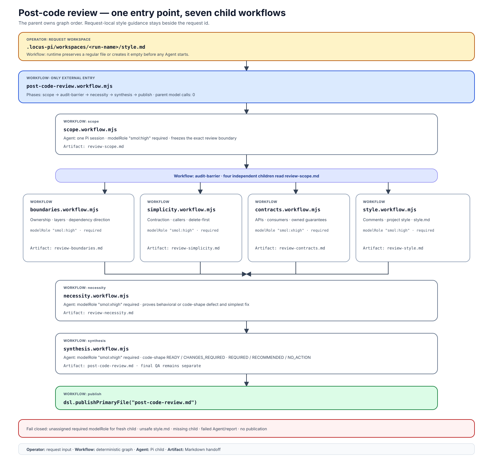

# Post-code review workflow tree

`post-code-review` is one installable code-review workflow composed from seven
saved child workflows. The parent makes no model call itself: it owns order,
parallelism, the shared output directory, child identity, and final publication.

> **External entry point:**
> [`post-code-review.workflow.mjs`](post-code-review.workflow.mjs). The other
> seven workflow files are source-bound child components coordinated by this
> parent.

The review uses several complementary perspectives rather than one repeated
style:

1. `post-code-review/scope` resolves the requested function, file, commit,
   commit range, diff, or locally available PR range into an exact evidence
   boundary. Historical targets keep base, target, and current-descendant
   evidence distinct, so later policy cannot be attributed to an older commit.
2. `post-code-review/boundaries`, `post-code-review/simplicity`,
   `post-code-review/contracts`, and `post-code-review/style` run behind one
   parallel barrier. Each reopens `review-scope.md`, inspects live evidence
   independently, and writes only its own report. The style lane also reads the
   request-local `style.md` criteria. The simplicity lane uses delete-first
   caller evidence and records a before/after contraction target.
3. `post-code-review/necessity` runs sequentially after the barrier, reopens the
   scope and all four lane reports, and challenges every proposed fix for a
   proven behavioral or code-shape defect, a clear guarantee owner, duplicated
   responsibility, and net simplicity. It splits immediate cleanup from future
   product work, preserves each lane's stable question id, and writes
   `review-necessity.md`. Historical targets are judged against their frozen
   tree rather than descendant policy.
4. `post-code-review/synthesis` reopens all six reports, independently verifies
   admitted findings and decision-critical positive/`NO_ACTION` claims against
   the frozen target and current live source, removes unsupported or duplicate
   claims, assigns the final code-shape action levels, and writes
   `post-code-review.md`. A proven defect introduced or materially worsened by
   the reviewed change remains REQUIRED even when its impact is low.
5. The parent publishes that final Markdown file as the run result.

The diagram below shows these workflow boundaries, exact source filenames,
model roles, Markdown handoffs, and the failure boundary on one canvas.



## Install

The tree ships with the locus-pi package. Follow [Getting started](../../../../docs/getting-started.md)
to install the published package or register a source checkout. Register it once;
do not copy workflow files into every project.

After installation, start Pi in the project to review and confirm the Package
entries:

```text
/workflows list post-code-review
```

Run the external parent with a new explicit project-relative output namespace:

```text
/workflows run post-code-review review the current diff
```

Before launch, assign the portable `smol` role through `/model-roles`. Every
review child declares `requireModelRole: true`; `smol:high` and `smol:xhigh`
use that assignment with different reasoning effort. An unassigned role stops
each fresh review child before it runs instead of silently inheriting the parent
session model. A resumed call may reuse that original child's recorded answer;
replay starts no child and remains marked as not-fresh evidence.

The runtime creates a unique `.locus-pi/workspaces/<generated-run-name>` workspace.
To provide additional comment and style criteria before launch, select an
explicit fresh workspace with `--output-dir <path>` and create
`<path>/style.md`. The runtime preserves an existing regular file byte-for-byte
or creates it empty before the first agent runs. Empty means no extra criteria;
the style lane still applies live project conventions. A symlink or non-regular
`style.md` fails closed.

The same entry is available through the programmatic `workflow` tool and the
headless Pi command surface. A fresh review must use a new output directory;
resume reuses the exact source run and workspace.

## Decision and remediation contract

The final report answers whether the reviewed code passes this code-shape gate.
It is not the final QA or merge verdict:

- `READY` — this gate passes and no source change is warranted;
- `READY_WITH_RECOMMENDATIONS` — this gate passes and only evidence-backed
  optional work outside the current change's acceptance contract remains;
- `CHANGES_REQUIRED` — at least one proven current behavioral, contract,
  documentation, ownership, style-contract, or code-shape defect must be fixed
  and re-reviewed;
- `BLOCKED` — live evidence is insufficient for a trustworthy decision.

Each item independently carries `Action: REQUIRED`, `RECOMMENDED`, or
`NO_ACTION`, plus `Impact: high`, `medium`, or `low`. This keeps mandatory work
separate from impact. A current-PR dead surface, fake parameter, duplicated
invariant owner, stale derived document, misleading behavior description,
unearned seam, or open delete/rewrite/owner move is REQUIRED when proven.
Personal taste, rejected proposals, future product choices, and accepted
responsibility boundaries remain visible as `NO_ACTION` or optional work rather
than disappearing.

For a REQUIRED or RECOMMENDED item, synthesis may include one small illustrative
fix snippet when it can do so truthfully. The snippet explains intended shape;
it is not a literal patch and never replaces ownership evidence, a complete
action, or verification. `NO_ACTION` items receive no fix snippet.

Apply the default REQUIRED set with the separate Package workflow `implement`:

```text
/workflows run implement --output-dir .locus-pi/workspaces/<generated-run-name> apply REQUIRED fixes from post-code-review.md
```

Reuse the review workspace so the workflow can read the exact report. To include
optional work, explicitly say `apply REQUIRED and RECOMMENDED fixes`. A `READY`
report or an unselected recommendation produces an intentional `NO_WORK` result.
`post-code-review` itself remains read-only and never starts implementation.
After remediation changes the reviewed head, run a fresh post-code review; the
old decision does not prove the new head.

## Source binding

All eight files are Package workflow entries because the Package registry scans
one directory level below `extensions/workflows/examples/`. The parent is the
intended external entry. Its seven `invokeWorkflow({ child })` edges bind
children to these installed Package files. A project or personal workflow with
the same name therefore cannot silently replace one child; a shadow causes the
run to fail before the child executes.

The children remain individually inspectable through `/workflows info`. Running
a lane directly is normally not useful because the boundaries, simplicity,
contracts, and synthesis lanes expect the parent's shared `review-scope.md`
handoff.

## Files in this directory

- `post-code-review.workflow.mjs` — external parent and final publisher.
- `scope.workflow.mjs` — exact scope and Git-semantics mapper.
- `boundaries.workflow.mjs` — ownership and architecture lane.
- `simplicity.workflow.mjs` — delete-first complexity lane.
- `contracts.workflow.mjs` — API, consumer, documentation, and
  validation-contract lane.
- `style.workflow.mjs` — comment quality and evidence-backed
  project-style lane with optional request-local criteria.
- `necessity.workflow.mjs` — sequential challenge to proposed
  fixes, their ownership, duplicated responsibility, and net complexity.
- `synthesis.workflow.mjs` — independent verifier and final
  report author.
- `post-code-review-pipeline.svg` — self-contained reader-facing interaction
  diagram.

The task-local `verify-post-code-review-bundle.mjs` and
`verify-post-code-review-scope-matrix.mjs` files are development checks, not
workflow entries and not installation artifacts. They validate the shipped
source graph and Git targeting rules during repository verification; operators
never run them to perform a code review.
